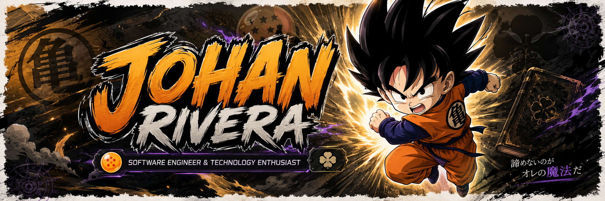

<div align="center">



</div>

<div align="center">

### Hi there 👋 I'm Johan Rivera, Backend Developer from Colombia

[](https://github.com/JARV005)
[](https://www.linkedin.com/in/johan-rivera-dev)

</div>

---


**About me**

- 🏗️ Building backends with **.NET** and **Node.js**
- 🤖 Exploring **AI Agents and MCP integrations**
- 👥 Looking to collaborate on **clean architecture and automation**
- 📚 Designing technical curricula for developer training programs
- 💬 Ask me about **ASP.NET Core, layered architecture, REST APIs**
- 🌍 Colombia 🇨🇴

<br clear="right"/>

---

### 📊 Stats

<div align="center">


&nbsp;


</div>

<div align="center">


</div>

---

### ⚔️ Magic Grimoire

> *Every grimoire reflects its wielder. Every skill here was forged, not given.*

<div align="center">

**Backend**


**Frontend**


**Databases**


**DevOps & Cloud**


**Architecture & AI**


</div>

---

### 🏅 Magic Knight Rank

```
Backend Developer     ████████████████████  .NET · Node.js · REST APIs
Full Stack            ███████████████░░░░░  Angular · React · Vue
Technical Lead        ████████████████░░░░  Mentoring · Code Review · Architecture
Software Architect    ████████████░░░░░░░░  Clean Arch · DDD · SOLID
AI & Automation       ████████░░░░░░░░░░░░  Agents · LLMs · MCPs
```

---

### 📡 Activity

<div align="center">

[](https://github.com/JARV005)

</div>

---

### 📬 Contact

<div align="center">

[](https://www.linkedin.com/in/johan-rivera-dev)
[](https://github.com/JARV005)

</div>

---

<div align="center">


*"It doesn't matter if you weren't born with power. What matters is that you never stop pushing past your limits."*

</div>
