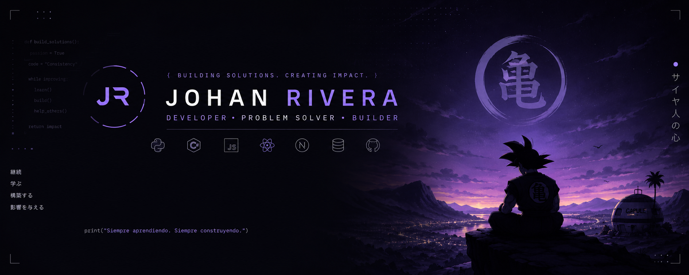

<div align="center">



</div>

<div align="center">

[](https://github.com/JARV005)
[](https://www.linkedin.com/in/johan-rivera-dev)

</div>

---

```yaml
nombre:     Johan Rivera
usuario:    JARV005
rol:        Backend Developer / Tech Lead
enfoque:    Arquitectura limpia · APIs REST · IA aplicada
ubicación:  Colombia
estado:     Siempre entrenando
```

Ingeniero de Software enfocado en **backends robustos**, **arquitectura por capas** y **liderazgo técnico**. Construyo sistemas empresariales, APIs REST de alto impacto y equipos de desarrollo. Actualmente integrando agentes de IA y automatización en soluciones reales.

> *"El poder no se hereda. Se forja con trabajo, constancia y cada línea de código que escribes."*

---

## ⚔️ Grimorio Técnico

> *Todo grimorio refleja la naturaleza de su portador. Este es el mío.*

**Backend**


**Frontend**


**Bases de Datos**


**DevOps & Cloud**


**Arquitectura & Diseño**


**IA & Automatización**


---

## 💥 Nivel de Poder

<div align="center">


</div>

<div align="center">


</div>

---

## 🏅 Rango de Caballero Mágico

```
Backend Developer     ████████████████████  APIs y servicios listos para producción
Full Stack            ███████████████░░░░░  Entrega de features de extremo a extremo
Technical Lead        ████████████████░░░░  Dirección técnica y estándares de código
Software Architect    ████████████░░░░░░░░  Diseño de sistemas y patrones de capas
IA & Automatización   ████████░░░░░░░░░░░░  Agentes, LLMs y pipelines automatizados
```

---

## 📖 Saga actual

- 🏗️ Sistemas backend con .NET 8 y arquitectura por capas en Node.js
- 🤖 Pipelines de automatización con agentes de IA e integraciones MCP
- 📚 Diseño de curricula técnica para programas de formación de developers
- ☁️ Despliegues en Azure con Docker y Kubernetes

---

## 🛠️ Arsenal


---

<div align="center">


*"No importa si no tienes poder innato. Lo que importa es que nunca dejes de superarte."*

</div>
