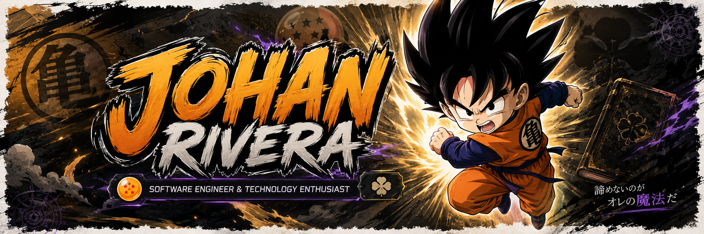
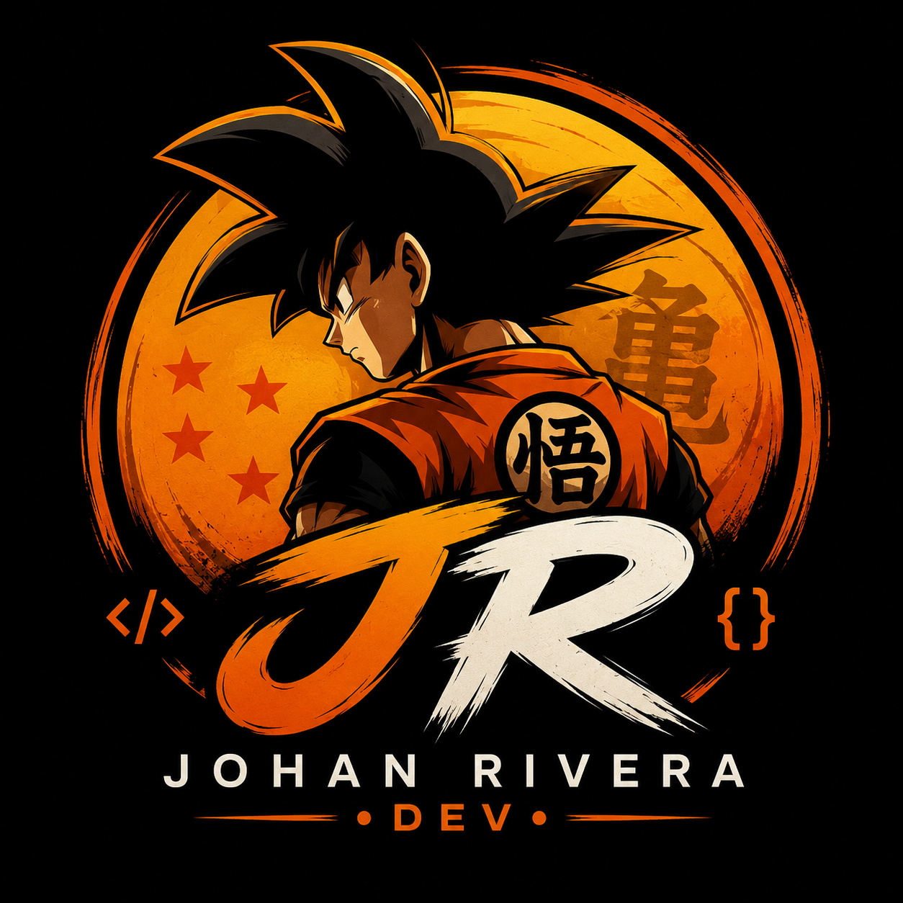

 

## About Me

I'm Johan — a **Backend Developer & Tech Lead** from Colombia. I build Node.js and .NET Core backends with clean architecture, DDD and a strong bias toward automation.

Right now I'm running three arcs at once: a full-time backend role, teaching the next generation of Node.js developers, and building my own AI-powered SaaS while launching a freelance career.

- 🧩 Focused on **clean architecture, DDD and testable backends**
- ☁️ Working daily with **Azure, Docker and Kubernetes**
- 🤖 Building an **AI-powered document analysis SaaS**
- 🎓 Teaching **Node.js & Azure fundamentals**
- 💬 Ask me about **APIs, backend design or cloud deployments**

 

## Tech Stack

<table>
  <tr>
    <td align="right"><b>Backend</b></td>
    <td>
      
      
      
      
      
      
    </td>
  </tr>
  <tr>
    <td align="right"><b>Frontend</b></td>
    <td>
      
      
      
      
      
      
    </td>
  </tr>
  <tr>
    <td align="right"><b>Databases</b></td>
    <td>
      
      
      
    </td>
  </tr>
  <tr>
    <td align="right"><b>DevOps &amp; Cloud</b></td>
    <td>
      
      
      
      
      
      
    </td>
  </tr>
  <tr>
    <td align="right"><b>Architecture &amp; AI</b></td>
    <td>
      
      
      
      
      
      
    </td>
  </tr>
</table>

<b>Experience level by technology</b>

 

| Technology | Level | |
|---|---|---|
| Node.js / Express | `██████████` | Expert |
| C# / .NET Core | `████████░░` | Advanced |
| SQL Server / PostgreSQL | `████████░░` | Advanced |
| Angular · React · Vue | `███████░░░` | Solid |
| Docker / Kubernetes | `██████░░░░` | Growing |
| Azure / AWS | `██████░░░░` | Growing |
| AI / ML &amp; Agents | `█████░░░░░` | Learning |

## GitHub Stats

## Featured Projects

<!-- Cambia "repo=" por los repositorios que quieras destacar -->

## Contact

 

  

<i>"It doesn't matter if you weren't born with power. What matters is that you never stop pushing past your limits."</i>

